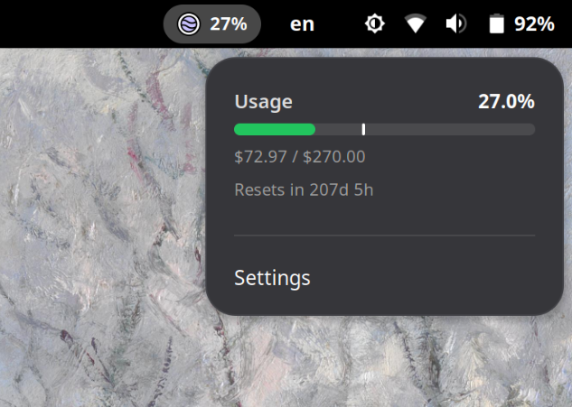

> Unofficial community project, not affiliated with or endorsed by Kagi Inc!



# Kagi LLM Usage

A GNOME Shell extension that displays your [Kagi Assistant](https://kagi.com/assistant) usage in the top panel. Requires a Kagi session token (see [Configuration](#configuration)).

Tested on GNOME 49, but may work on older versions.

## Features

- Kagi LLM usage monitoring (scraped from the billing page)
- Multiple display modes: text percentage, progress bar, or both
- Billing cycle timeline with renewal countdown
- HTTP proxy support

## Installation

### Manual

```bash
git clone git@github.com:droserasprout/gnome-kagi-llm-usage.git
cd gnome-kagi-llm-usage
make install
```

### Configuration

1. Open the extension settings
2. Paste your Kagi session link (e.g. `https://kagi.com/search?token=TOKEN&q=%s`)
3. The extension extracts the token and fetches billing data from https://kagi.com/settings/billing

## Credits

This is a fork of [claude-usage-extension](https://github.com/Haletran/claude-usage-extension) by [Baptiste-Pasquier](https://github.com/Haletran)

## License

[MIT](LICENSE)
